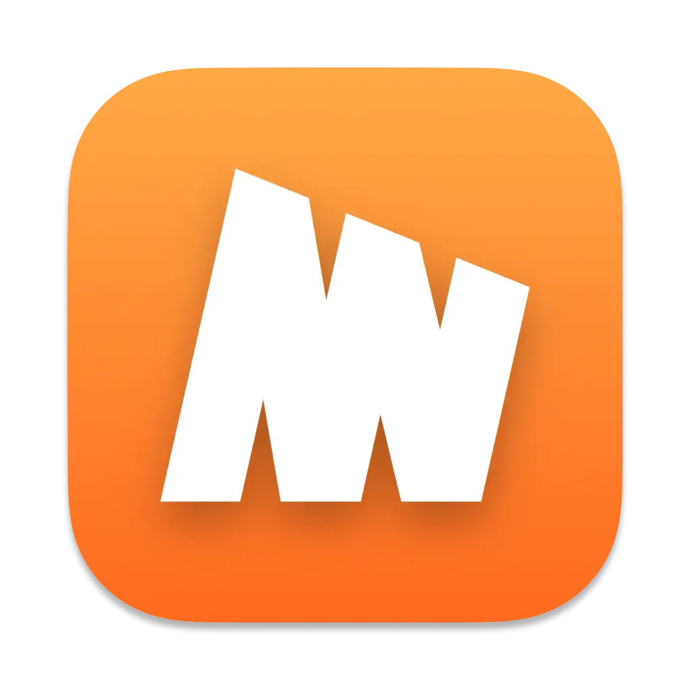

# Minima Electron

A desktop application for running a Minima node. Provides a clean interface for interacting with the Minima protocol on your desktop.

## Features

- **Clean Interface**: Minimal design focused on content
- **MiniDapp Support**: Embedded webview support for decentralized applications
- **Cross-Platform**: Built with Electron for Windows, macOS, and Linux
- **Modern Architecture**: Modular design with separate components for settings, tray, and core functionality
- **Developer Tools**: Built-in development tools (hidden in production builds)
- **Native Integration**: Platform-specific menus and system tray support

## Installation

### Prerequisites

- Node.js (v14 or higher)
- npm or yarn

### Development Setup

1. Clone the repository:
```bash
git clone https://github.com/berkaytumal/MinimaElectron
cd minima-electron
```

2. Install dependencies:
```bash
npm install
```

3. Start the development server:
```bash
npm start
```

### Building for Production

Build the application for your platform:

```bash
# Build for current platform
npm run build

# Build for specific platforms
npm run build:mac
npm run build:win
npm run build:linux
```

## Contributing

Contributions are most welcome! Feel free to submit issues and pull requests to help improve **FxFilterJS**.

1. Fork the repository.
2. Create a new branch for your feature or bugfix.
3. Submit a pull request when your code is ready.

## License

This project is licensed under the MIT License - see the [LICENSE](LICENSE) file for details.

## Contact

For any inquiries or feedback, feel free to reach out!

<a href="https://www.buymeacoffee.com/berkaytumal" target="_blank"></a>